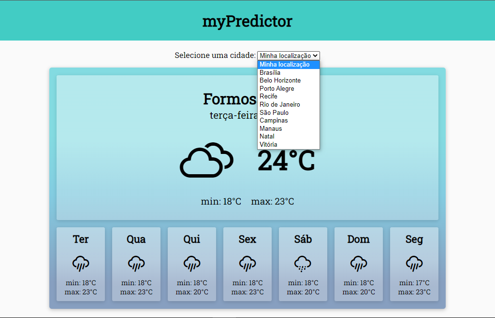
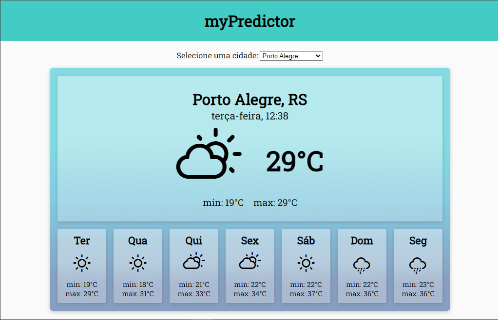

# Previsão do Clima
Este é um projeto feito EXCLUSIVAMENTE por mim de forma ORIGINAL, sem qualquer cópia de código de terceiros ou tutorial seguido.

> Utilza HTML5, CSS3 e JavaScript para implementar uma aplicação de previsão do clima, através do consumo de uma API. 

## Algumas observações
- A aplicação não é responsiva, uma vez que o intuito do projeto era apenas praticar o consumo de API.
- A API consumida pode ser encontrada em https://hgbrasil.com/status/weather

## Visualize o projeto
- A chave necessária para o uso exposto da API no Github Pages excedeu o limite de consultas, portanto, caso queira visualizar o projeto, baixe os arquivos e abra localmente. 

